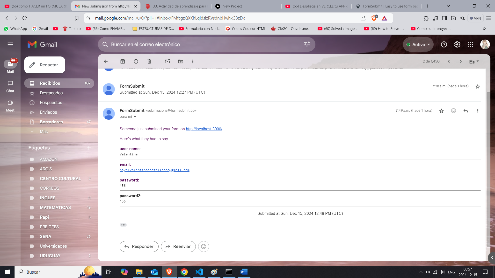

# Sabor Colombia
Es una página web en la que promociona **la gastronomía de colombia**, en ella puede encontrar los ingredientes que usa cada región del pais, los platos tipicos y los comentarios de usuarios sobre cada una de las comidas.

Este sitio web se diseño con los lenguajes de programación **HTML**, **CSS** y **JavaScript**, ademas se puede visualizar en diferentes dispositivos gracias al diseño responsive y los estilos en CSS como: Flexbox, grid y media queries.

Tambien se desarrollo la parte del back-end con node.js, creando una api y utilizando el fetch para crear un formulario que muestre los datos del usuario.
Se elaboro la integracion del back-end con el front-end a traves de la api form submit y node js para mostrar al usuario los datos que ingreso en el 
formulario suscripcion en un correo electronico.

## Caracteristicas del proyecto
- **Rendimiento:** Se utilizo la herramienta Lighthouse, aqui la pagina tiene excelentes resultados en cuanto a rendimiento,accesibilidad,recomendaciones y SEO

- **Integracion:** Se hizo la conexion con el back-end y el front-end con formsubmit, esta api muestra los datos que ingreso el usuario en el formulario utilizando el method POST a traves de un mensaje de correo electronico

- **Despliegue:** En la plataforma verdel se puede observar el proyecto final.

## Instrucciones
- **Paso 1:** Instalar Node js y lite server
- **Paso 2:** Inicializar en el cmd o el terminal de Visual con la instruccion npm run dev

- **Paso 3:** En el archivo suscripcion.html en la seccion form encontrara la api <form action="https://formsubmit.co/your@email.com" method="POST"> method= "POST" a esta api va mostrar los datos que el usuario ingreso en el formulario, en la direccion your email puede escribir el correo electronico y alli enviara los datos que haya ingresado en el formulario

- **Paso 4:** Dar click en no soy un robot y luego aparecera el siguiente mensaje de confirmacion.

- **Paso 5:** Consultar el correo electronico.

## Tech Stack

**Lenguajes de Programación:** HTML, CSS, Javascript , NodeJS, Form Submit.

**Entorno de Trabajo:** GitHub, Visual Studio Code, Readme.so, Navegador
Web, Lighthouse.

## Authors

- [@Nayel2004](https://www.github.com/Nayel2004)
- UMB.(2024).Módulo 3 Herramientas y tecnologias avanzadas.
- Toquica D (26 noviembre 2024).HTML CSS Y JS [MP4]. Recuperado de  Clic para ver la grabaciónLinks to an external site..

